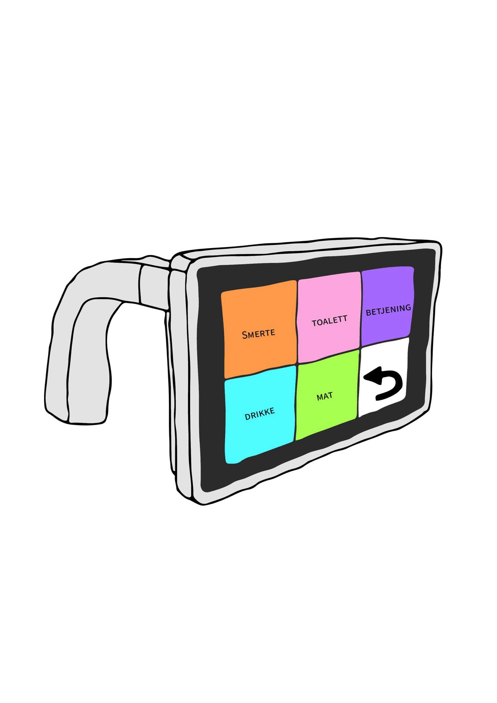

# ELSYS-Prosjekt Gruppe 15

## Varselvenn

## Modell og utforming

## Biblotek

Her ligger kode for både brukerenhet, og styreenhet.
All kode er skrevet i python, og bruker føgende biblotek:

- **Tkinter** - for UI
- **Socket** - for Bluethooth komunikasjon
- **Thread** - for å kunne kjøre flere prosesser samtidig
- **Time** - for å bruke rett tid
- **SimpleMFRC522** - for NFC-leser til kortscanning
- **RPi GPIO** - for tilkobling av GPIO pins på Rpi

## Maskinvare

### Brukerenhet

* **Raspberry pi 3B+** - Denne kjører alt av programvare og er tilkoblet skjerm, knapp og RFID scanner.
* **RPi 7" Touch display** - skjerm som er koblet til Rpi i brukerenhet. Kobles til ved to kabler for 5v og GND, og en båndkablel til DSI porten. 
* **MRFC522** -  Tilkoblet RFID scanner, bruker (SPI) protokoll for å "prate" sammen med Rpi.
* **Momentary Push Button -** Knapp som benyttes til SOS modus på brukerenhet. Koblet til GPIO pin på Rpi

Under vises oppkobling av brukerenhet:

### Styreenhet

* **Standar PC -** Her benyttes pc av typen Lenovo legion, men det er mulig og benytte andre pc-er så lenge de har mulighet for blåtann komunikasjon. 

## Programvare

* **ControllerGUI -** Hovedfil som kjøres på styreenhet. Tilpasset til å kjøre på fullskjerm og må kjøres før MainGUI på brukerenhet.
* **ControllerFunctions -** inneholder funksjoner som kjøres i Controller GUI, som bl.a. sortering av rom retrunering av farer og posisjon til rom.
* **MainGUI** - Kjøres på brukerenhet og inneholder tk inter funksjoner for oppretting av bruker interface.
* **read** - inneholder funksjoner for lesing av RFID kort. includeres som RFID i MainGUI.
